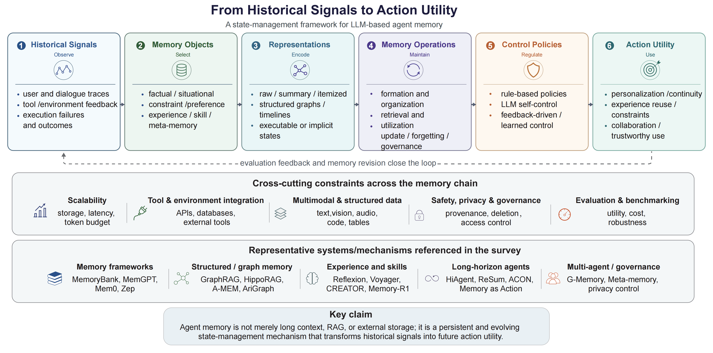

<h1 align="center">
  <strong>From Historical Signals to Action Utility:<br>A Survey of Memory Mechanisms for LLM-based Agents</strong>
</h1>

<div align="center">


[](https://github.com/README.md)

</div>

## News
- [2026/06/18] This repository is created to maintain a paper list accompanying the survey "From Historical Signals to Action Utility: A Survey of Memory Mechanisms for LLM-based Agents".
- [2026/06/18] The survey paper and accompanying bibliography are now available.

## Introduction

Large language model (LLM)-based agents are increasingly expected to operate across long interaction histories, repeated user sessions, tool calls, changing environments, and multi-step tasks. These settings require agents to preserve and reuse information beyond a single context window.

This survey studies agent memory as an **action-oriented state-management mechanism** that transforms historical signals into future action utility. We organize the literature through a unified chain:

```
Historical Signals -> Memory Objects -> Memory Representations -> Memory Operations -> Control Policies -> Action Utility
```

<p align="center">
  
  <br>
  <em>Figure 1: The unified framework of agent memory mechanisms — from historical signals to action utility.</em>
</p>

### Key Taxonomy Dimensions

- **Memory Objects** (What should agents remember?): Factual, Situational, Constraint, Experiential, Procedural, Meta-memory
- **Memory Representations** (How are memories carried?): Raw Record, Summary, Itemized, Structured, Executable, Implicit
- **Memory Operations** (How are memories managed?): Formation, Organization, Retrieval, Utilization, Updating/Forgetting, Governance
- **Control Policies** (Who decides memory operations?): Rule-Based, LLM Self-Control, Feedback-Driven, Learning-Based
- **Memory Utility** (What does memory enable?): Personalization, Task Continuity, Experience Reuse, Decision Constraints, Multi-Agent Collaboration, Trustworthy Deployment

---

## Paper List

*Total: 107 papers organized by the survey taxonomy.*

### Memory Objects

#### Factual Memory

- [2024] MemoryBank: Enhancing Large Language Models with Long-Term Memory. [[paper](https://doi.org/10.1609/AAAI.V38I17.29946)]
- [2023] MemGPT: Towards LLMs as Operating Systems. [[paper](https://arxiv.org/abs/2310.08560)]
- [2025] Mem0: Building Production-Ready AI Agents with Scalable Long-Term Memory.
- [2025] Zep: A Temporal Knowledge Graph Architecture for Agent Memory.
- [2025] A-MEM: Agentic Memory for LLM Agents.
- [2025] SeCom: On Memory Construction and Retrieval for Personalized Conversational Agents.
- [2023] Augmenting Language Models with Long-Term Memory. [[paper](https://arxiv.org/abs/2306.07174)]
- [2023] Memochat: Tuning llms to use memos for consistent long-range open-domain conversation. [[paper](https://arxiv.org/abs/2308.08239)]
- [2023] Recurrentgpt: Interactive generation of (arbitrarily) long text. [[paper](https://arxiv.org/abs/2305.13304)]

#### Situational Memory

- [2023] Generative Agents: Interactive Simulacra of Human Behavior.
- [2023] ReAct: Synergizing Reasoning and Acting in Language Models.
- [2023] Reflexion: Language Agents with Verbal Reinforcement Learning.
- [2025] HiAgent: Hierarchical Working Memory Management for Solving Long-Horizon Agent Tasks with Large Language Model.
- [2024] MovieChat: From Dense Token to Sparse Memory for Long Video Understanding. [[paper](https://doi.org/10.1109/CVPR52733.2024.01725)]
- [2025] WorldMM: Dynamic Multimodal Memory Agent for Long Video Reasoning.
- [2025] Embodied VideoAgent: Persistent Memory from Egocentric Videos and Embodied Sensors Enables Dynamic Scene Understanding. [[paper](https://arxiv.org/abs/2501.00358)]
- [2024] Video-RAG: Visually-Aligned Retrieval-Augmented Long Video Comprehension. [[paper](https://arxiv.org/abs/2411.13093)]
- [2025] Mem2Ego: Empowering Vision-Language Models with Global-to-Ego Memory for Long-Horizon Embodied Navigation. [[paper](https://arxiv.org/abs/2502.14254)]
- [2025] UFO2: The Desktop AgentOS. [[paper](https://arxiv.org/abs/2504.14603)]
- [2026] MEMENTO: Teaching LLMs to Manage Their Own Context. [[paper](https://arxiv.org/abs/2604.09852)]
- [2024] Evaluating Very Long-Term Conversational Memory of LLM Agents.
- [2024] LongMemEval: Benchmarking Chat Assistants on Long-Term Interactive Memory. [[paper](https://arxiv.org/abs/2410.10813)]

#### Constraint Memory

- [2024] MemoryBank: Enhancing Large Language Models with Long-Term Memory. [[paper](https://doi.org/10.1609/AAAI.V38I17.29946)]
- [2025] Mem0: Building Production-Ready AI Agents with Scalable Long-Term Memory.
- [2025] Zep: A Temporal Knowledge Graph Architecture for Agent Memory.
- [2025] A-MEM: Agentic Memory for LLM Agents.
- [2025] Unveiling Privacy Risks in LLM Agent Memory. [[paper](https://arxiv.org/abs/2502.13172)]

#### Experiential Memory

- [2023] Reflexion: Language Agents with Verbal Reinforcement Learning.
- [2023] Generative Agents: Interactive Simulacra of Human Behavior.
- [2025] Memory-R1: Enhancing Large Language Model Agents to Manage and Utilize Memories via Reinforcement Learning.
- [2025] MemAgent: Reshaping Long-Context LLM with Multi-Conv RL-Based Memory Agent. [[paper](https://arxiv.org/abs/2507.02259)]
- [2024] ExpeL: LLM Agents Are Experiential Learners. [[paper](https://doi.org/10.1609/AAAI.V38I17.29936)]
- [2024] Self-evolving Agents with reflective and memory-augmented abilities. [[paper](https://arxiv.org/abs/2409.00872)]
- [2025] Dynamic Cheatsheet: Test-Time Learning with Adaptive Memory. [[paper](https://arxiv.org/abs/2504.07952)]
- [2025] H²R: Hierarchical Hindsight Reflection for Multi-Task LLM Agents. [[paper](https://arxiv.org/abs/2509.12810)]
- [2025] Agent KB: Leveraging Cross-Domain Experience for Agentic Problem Solving. [[paper](https://arxiv.org/abs/2507.06229)]
- [2025] ReasoningBank: Scaling Agent Self-Evolving with Reasoning Memory. [[paper](https://arxiv.org/abs/2509.25140)]
- [2025] FLEX: Continuous Agent Evolution via Forward Learning from Experience. [[paper](https://arxiv.org/abs/2511.06449)]
- [2026] MemRL: Self-Evolving Agents via Runtime Reinforcement Learning on Episodic Memory. [[paper](https://arxiv.org/abs/2601.03192)]
- [2025] MemEvolve: Meta-Evolution of Agent Memory Systems. [[paper](https://arxiv.org/abs/2512.18746)]
- [2026] Agentic Memory: Learning Unified Long-Term and Short-Term Memory Management for Large Language Model Agents. [[paper](https://arxiv.org/abs/2601.01885)]

#### Procedural / Skill Memory

- [2023] Voyager: An Open-Ended Embodied Agent with Large Language Models. [[paper](https://arxiv.org/abs/2305.16291)]
- [2023] CREATOR: Tool Creation for Disentangling Abstract and Concrete Reasoning of Large Language Models. [[paper](https://arxiv.org/abs/2305.14318)]
- [2023] Toolformer: Language Models Can Teach Themselves to Use Tools.
- [2023] ToolLLM: Facilitating Large Language Models to Master 16000+ Real-world APIs. [[paper](https://arxiv.org/abs/2307.16789)]
- [2025] JARVIS-1: Open-World Multi-Task Agents With Memory-Augmented Multimodal Language Models.
- [2025] SkillWeaver: Web Agents can Self-Improve by Discovering and Honing Skills. [[paper](https://arxiv.org/abs/2504.07079)]
- [2025] Agent Workflow Memory.
- [2025] LEGOMem: Modular Procedural Memory for Multi-agent LLM Systems for Workflow Automation. [[paper](https://arxiv.org/abs/2510.04851)]
- [2025] Memp: Exploring Agent Procedural Memory. [[paper](https://arxiv.org/abs/2508.06433)]
- [2025] ToolMem: Enhancing Multimodal Agents with Learnable Tool Capability Memory. [[paper](https://arxiv.org/abs/2510.06664)]
- [2025] Inducing Programmatic Skills for Agentic Tasks. [[paper](https://arxiv.org/abs/2504.06821)]
- [2024] Towards Completeness-Oriented Tool Retrieval for Large Language Models.
- [2025] Retrieval Models Aren't Tool-Savvy: Benchmarking Tool Retrieval for Large Language Models.
- [2025] ToolGen: Unified Tool Retrieval and Calling via Generation.

#### Meta-Memory

- [2025] Zep: A Temporal Knowledge Graph Architecture for Agent Memory.
- [2025] Mem0: Building Production-Ready AI Agents with Scalable Long-Term Memory.
- [2025] A-MEM: Agentic Memory for LLM Agents.
- [2025] Unveiling Privacy Risks in LLM Agent Memory. [[paper](https://arxiv.org/abs/2502.13172)]

### Memory Representations

#### Raw Record Memories

- [2023] Generative Agents: Interactive Simulacra of Human Behavior.
- [2023] Memochat: Tuning llms to use memos for consistent long-range open-domain conversation. [[paper](https://arxiv.org/abs/2308.08239)]
- [2024] MovieChat: From Dense Token to Sparse Memory for Long Video Understanding. [[paper](https://doi.org/10.1109/CVPR52733.2024.01725)]
- [2025] WorldMM: Dynamic Multimodal Memory Agent for Long Video Reasoning.
- [2025] Embodied VideoAgent: Persistent Memory from Egocentric Videos and Embodied Sensors Enables Dynamic Scene Understanding. [[paper](https://arxiv.org/abs/2501.00358)]
- [2025] Mem2Ego: Empowering Vision-Language Models with Global-to-Ego Memory for Long-Horizon Embodied Navigation. [[paper](https://arxiv.org/abs/2502.14254)]
- [2025] UFO2: The Desktop AgentOS. [[paper](https://arxiv.org/abs/2504.14603)]
- [2024] Video-RAG: Visually-Aligned Retrieval-Augmented Long Video Comprehension. [[paper](https://arxiv.org/abs/2411.13093)]
- [2026] MEMENTO: Teaching LLMs to Manage Their Own Context. [[paper](https://arxiv.org/abs/2604.09852)]
- [2023] Recurrentgpt: Interactive generation of (arbitrarily) long text. [[paper](https://arxiv.org/abs/2305.13304)]

#### Summary Memories

- [2023] Recursively Summarizing Enables Long-Term Dialogue Memory in Large Language Models. [[paper](https://arxiv.org/abs/2308.15022)]
- [2023] Memochat: Tuning llms to use memos for consistent long-range open-domain conversation. [[paper](https://arxiv.org/abs/2308.08239)]
- [2023] Recurrentgpt: Interactive generation of (arbitrarily) long text. [[paper](https://arxiv.org/abs/2305.13304)]
- [2025] Compress to Impress: Unleashing the Potential of Compressive Memory in Real-World Long-Term Conversations.
- [2025] LightMem: Lightweight and Efficient Memory-Augmented Generation.
- [2025] R³Mem: Bridging Memory Retention and Retrieval via Reversible Compression. [[paper](https://arxiv.org/abs/2502.15957)]
- [2025] From Context to EDUs: Faithful and Structured Context Compression via Elementary Discourse Unit Decomposition. [[paper](https://arxiv.org/abs/2512.14244)]
- [2025] ACON: Optimizing Context Compression for Long-horizon LLM Agents.
- [2025] ReSum: Unlocking Long-Horizon Search Intelligence via Context Summarization.
- [2023] LongLLMLingua: Accelerating and Enhancing LLMs in Long Context Scenarios via Prompt Compression. [[paper](https://arxiv.org/abs/2310.06839)]

#### Itemized Memories

- [2024] MemoryBank: Enhancing Large Language Models with Long-Term Memory. [[paper](https://doi.org/10.1609/AAAI.V38I17.29946)]
- [2025] Mem0: Building Production-Ready AI Agents with Scalable Long-Term Memory.
- [2025] SeCom: On Memory Construction and Retrieval for Personalized Conversational Agents.
- [2025] Agent KB: Leveraging Cross-Domain Experience for Agentic Problem Solving. [[paper](https://arxiv.org/abs/2507.06229)]
- [2025] MemGuide: Intent-Driven Memory Selection for Goal-Oriented Multi-Session LLM Agents. [[paper](https://arxiv.org/abs/2505.20231)]
- [2025] A-MEM: Agentic Memory for LLM Agents.

#### Structured Memories

- [2025] Zep: A Temporal Knowledge Graph Architecture for Agent Memory.
- [2024] From Local to Global: A Graph RAG Approach to Query-Focused Summarization. [[paper](https://arxiv.org/abs/2404.16130)]
- [2024] HippoRAG: Neurobiologically Inspired Long-Term Memory for Large Language Models.
- [2025] From RAG to Memory: Non-Parametric Continual Learning for Large Language Models. [[paper](https://arxiv.org/abs/2502.14802)]
- [2025] AriGraph: Learning Knowledge Graph World Models with Episodic Memory for LLM Agents. [[paper](https://arxiv.org/abs/2407.04363)]
- [2025] From Isolated Conversations to Hierarchical Schemas: Dynamic Tree Memory Representation for LLMs.
- [2024] Enhancing Long-Term Memory using Hierarchical Aggregate Tree for Retrieval Augmented Generation. [[paper](https://arxiv.org/abs/2406.06124)]
- [2026] MAGMA: A Multi-Graph based Agentic Memory Architecture for AI Agents. [[paper](https://arxiv.org/abs/2601.03236)]
- [2025] SGMem: Sentence Graph Memory for Long-Term Conversational Agents. [[paper](https://arxiv.org/abs/2509.21212)]
- [2025] G-Memory: Tracing Hierarchical Memory for Multi-Agent Systems. [[paper](https://arxiv.org/abs/2506.07398)]
- [2025] MIRIX: Multi-Agent Memory System for LLM-Based Agents. [[paper](https://arxiv.org/abs/2507.07957)]
- [2025] Intrinsic Memory Agents: Heterogeneous Multi-Agent LLM Systems through Structured Contextual Memory. [[paper](https://arxiv.org/abs/2508.08997)]
- [2025] D-SMART: Enhancing LLM Dialogue Consistency via Dynamic Structured Memory And Reasoning Tree. [[paper](https://arxiv.org/abs/2510.13363)]
- [2024] LightRAG: Simple and Fast Retrieval-Augmented Generation. [[paper](https://arxiv.org/abs/2410.05779)]
- [2025] RGMem: Renormalization Group-based Memory Evolution for Language Agent User Profile.
- [2026] EverMemOS: A Self-Organizing Memory Operating System for Structured Long-Horizon Reasoning.

#### Executable Memories

- [2023] Voyager: An Open-Ended Embodied Agent with Large Language Models. [[paper](https://arxiv.org/abs/2305.16291)]
- [2025] JARVIS-1: Open-World Multi-Task Agents With Memory-Augmented Multimodal Language Models.
- [2025] SkillWeaver: Web Agents can Self-Improve by Discovering and Honing Skills. [[paper](https://arxiv.org/abs/2504.07079)]
- [2025] Agent Workflow Memory.
- [2023] Toolformer: Language Models Can Teach Themselves to Use Tools.
- [2023] ToolLLM: Facilitating Large Language Models to Master 16000+ Real-world APIs. [[paper](https://arxiv.org/abs/2307.16789)]
- [2023] CREATOR: Tool Creation for Disentangling Abstract and Concrete Reasoning of Large Language Models. [[paper](https://arxiv.org/abs/2305.14318)]
- [2025] LEGOMem: Modular Procedural Memory for Multi-agent LLM Systems for Workflow Automation. [[paper](https://arxiv.org/abs/2510.04851)]
- [2025] Memp: Exploring Agent Procedural Memory. [[paper](https://arxiv.org/abs/2508.06433)]
- [2025] ToolMem: Enhancing Multimodal Agents with Learnable Tool Capability Memory. [[paper](https://arxiv.org/abs/2510.06664)]
- [2025] Inducing Programmatic Skills for Agentic Tasks. [[paper](https://arxiv.org/abs/2504.06821)]

#### Implicit Memories

- [2021] K-Adapter: Infusing Knowledge into Pre-Trained Models with Adapters.
- [2022] Locating and Editing Factual Associations in GPT.
- [2023] Mass-Editing Memory in a Transformer.
- [2024] WISE: Rethinking the Knowledge Memory for Lifelong Model Editing of Large Language Models.
- [2025] MemLoRA: Distilling Expert Adapters for On-Device Memory Systems. [[paper](https://arxiv.org/abs/2512.04763)]
- [2024] Memory³: Language Modeling with Explicit Memory. [[paper](https://arxiv.org/abs/2407.01178)]
- [2025] M+: Extending MemoryLLM with Scalable Long-Term Memory.
- [2025] Titans: Learning to Memorize at Test Time. [[paper](https://arxiv.org/abs/2501.00663)]
- [2025] Memory Decoder: A Pretrained, Plug-and-Play Memory for Large Language Models. [[paper](https://arxiv.org/abs/2508.09874)]
- [2024] SnapKV: LLM Knows What You are Looking for Before Generation.
- [2023] H_2O: Heavy-Hitter Oracle for Efficient Generative Inference of Large Language Models.
- [2023] Scissorhands: Exploiting the Persistence of Importance Hypothesis for LLM KV Cache Compression. [[paper](https://arxiv.org/abs/2305.17118)]
- [2023] Learning to Compress Prompts with Gist Tokens.
- [2024] In-context Autoencoder for Context Compression in a Large Language Model.
- [2024] Efficient Streaming Language Models with Attention Sinks.

### Memory Operations

#### Formation

- [2025] Pre-Storage Reasoning for Episodic Memory: Shifting Inference Burden to Memory for Personalized Dialogue.
- [2026] Beyond Static Summarization: Proactive Memory Extraction for LLM Agents.
- [2025] Mem0: Building Production-Ready AI Agents with Scalable Long-Term Memory.
- [2025] SeCom: On Memory Construction and Retrieval for Personalized Conversational Agents.
- [2025] A-MEM: Agentic Memory for LLM Agents.
- [2025] Nemori: Self-Organizing Agent Memory Inspired by Cognitive Science.
- [2025] Memory-R1: Enhancing Large Language Model Agents to Manage and Utilize Memories via Reinforcement Learning.
- [2025] Mem-α: Learning Memory Construction via Reinforcement Learning.

#### Organization & Consolidation

- [2025] Zep: A Temporal Knowledge Graph Architecture for Agent Memory.
- [2024] From Local to Global: A Graph RAG Approach to Query-Focused Summarization. [[paper](https://arxiv.org/abs/2404.16130)]
- [2024] HippoRAG: Neurobiologically Inspired Long-Term Memory for Large Language Models.
- [2025] From RAG to Memory: Non-Parametric Continual Learning for Large Language Models. [[paper](https://arxiv.org/abs/2502.14802)]
- [2025] From Isolated Conversations to Hierarchical Schemas: Dynamic Tree Memory Representation for LLMs.
- [2024] Enhancing Long-Term Memory using Hierarchical Aggregate Tree for Retrieval Augmented Generation. [[paper](https://arxiv.org/abs/2406.06124)]
- [2025] RGMem: Renormalization Group-based Memory Evolution for Language Agent User Profile.
- [2026] EverMemOS: A Self-Organizing Memory Operating System for Structured Long-Horizon Reasoning.
- [2025] D-SMART: Enhancing LLM Dialogue Consistency via Dynamic Structured Memory And Reasoning Tree. [[paper](https://arxiv.org/abs/2510.13363)]

#### Retrieval

- [2025] MemGuide: Intent-Driven Memory Selection for Goal-Oriented Multi-Session LLM Agents. [[paper](https://arxiv.org/abs/2505.20231)]
- [2024] HippoRAG: Neurobiologically Inspired Long-Term Memory for Large Language Models.
- [2025] From RAG to Memory: Non-Parametric Continual Learning for Large Language Models. [[paper](https://arxiv.org/abs/2502.14802)]
- [2025] Memory-augmented Query Reconstruction for LLM-based Knowledge Graph Reasoning.
- [2024] Towards Completeness-Oriented Tool Retrieval for Large Language Models.
- [2025] Retrieval Models Aren't Tool-Savvy: Benchmarking Tool Retrieval for Large Language Models.
- [2025] ToolMem: Enhancing Multimodal Agents with Learnable Tool Capability Memory. [[paper](https://arxiv.org/abs/2510.06664)]
- [2023] Retrieval-Augmented Generation for Large Language Models: A Survey. [[paper](https://arxiv.org/abs/2312.10997)]
- [2024] Self-RAG: Learning to Retrieve, Generate, and Critique through Self-Reflection.
- [2024] FlashRAG: A Modular Toolkit for Efficient Retrieval-Augmented Generation Research. [[paper](https://arxiv.org/abs/2405.13576)]
- [2025] MemoRAG: Moving towards Next-Gen RAG via Memory-Inspired Knowledge Discovery.
- [2024] PlanRAG: A Plan-then-Retrieval Augmented Generation for Generative Large Language Models as Decision Makers.

#### Injection & Utilization

- [2025] Memory as Action: Autonomous Context Curation for Long-Horizon Agentic Tasks.
- [2025] ACON: Optimizing Context Compression for Long-horizon LLM Agents.
- [2025] ReSum: Unlocking Long-Horizon Search Intelligence via Context Summarization.
- [2025] MEM1: Learning to Synergize Memory and Reasoning for Efficient Long-Horizon Agents.
- [2023] RET-LLM: Towards a General Read-Write Memory for Large Language Models. [[paper](https://arxiv.org/abs/2305.14322)]

#### Updating, Forgetting & Governance

- [2024] MemoryBank: Enhancing Large Language Models with Long-Term Memory. [[paper](https://doi.org/10.1609/AAAI.V38I17.29946)]
- [2026] FadeMem: Biologically-Inspired Forgetting for Efficient Agent Memory.
- [2025] RGMem: Renormalization Group-based Memory Evolution for Language Agent User Profile.
- [2025] Memory-R1: Enhancing Large Language Model Agents to Manage and Utilize Memories via Reinforcement Learning.
- [2025] Mem-α: Learning Memory Construction via Reinforcement Learning.
- [2025] Zep: A Temporal Knowledge Graph Architecture for Agent Memory.
- [2026] EverMemOS: A Self-Organizing Memory Operating System for Structured Long-Horizon Reasoning.
- [2025] Unveiling Privacy Risks in LLM Agent Memory. [[paper](https://arxiv.org/abs/2502.13172)]

### Control Policies

#### Rule-Based Control

- [2023] Recursively Summarizing Enables Long-Term Dialogue Memory in Large Language Models. [[paper](https://arxiv.org/abs/2308.15022)]
- [2024] MemoryBank: Enhancing Large Language Models with Long-Term Memory. [[paper](https://doi.org/10.1609/AAAI.V38I17.29946)]
- [2023] MemGPT: Towards LLMs as Operating Systems. [[paper](https://arxiv.org/abs/2310.08560)]
- [2025] LightMem: Lightweight and Efficient Memory-Augmented Generation.
- [2023] Enhancing Large Language Model with Self-Controlled Memory Framework. [[paper](https://arxiv.org/abs/2304.13343)]

#### LLM Self-Control

- [2023] Generative Agents: Interactive Simulacra of Human Behavior.
- [2023] MemGPT: Towards LLMs as Operating Systems. [[paper](https://arxiv.org/abs/2310.08560)]
- [2025] A-MEM: Agentic Memory for LLM Agents.
- [2025] Mem0: Building Production-Ready AI Agents with Scalable Long-Term Memory.
- [2023] Reflexion: Language Agents with Verbal Reinforcement Learning.
- [2025] Hindsight is 20/20: Building Agent Memory that Retains, Recalls, and Reflects. [[paper](https://arxiv.org/abs/2512.12818)]
- [2025] Nemori: Self-Organizing Agent Memory Inspired by Cognitive Science.

#### Feedback-Driven Control

- [2023] Reflexion: Language Agents with Verbal Reinforcement Learning.
- [2024] ExpeL: LLM Agents Are Experiential Learners. [[paper](https://doi.org/10.1609/AAAI.V38I17.29936)]
- [2024] Self-evolving Agents with reflective and memory-augmented abilities. [[paper](https://arxiv.org/abs/2409.00872)]
- [2025] Dynamic Cheatsheet: Test-Time Learning with Adaptive Memory. [[paper](https://arxiv.org/abs/2504.07952)]
- [2025] H²R: Hierarchical Hindsight Reflection for Multi-Task LLM Agents. [[paper](https://arxiv.org/abs/2509.12810)]
- [2025] Agent KB: Leveraging Cross-Domain Experience for Agentic Problem Solving. [[paper](https://arxiv.org/abs/2507.06229)]
- [2025] ReasoningBank: Scaling Agent Self-Evolving with Reasoning Memory. [[paper](https://arxiv.org/abs/2509.25140)]
- [2025] FLEX: Continuous Agent Evolution via Forward Learning from Experience. [[paper](https://arxiv.org/abs/2511.06449)]
- [2026] MEMENTO: Teaching LLMs to Manage Their Own Context. [[paper](https://arxiv.org/abs/2604.09852)]

#### Learning-Based Control

- [2025] Memory-R1: Enhancing Large Language Model Agents to Manage and Utilize Memories via Reinforcement Learning.
- [2025] Mem-α: Learning Memory Construction via Reinforcement Learning.
- [2025] MemSearcher: Training LLMs to Reason, Search and Manage Memory via End-to-End Reinforcement Learning. [[paper](https://arxiv.org/abs/2511.02805)]
- [2025] MemAgent: Reshaping Long-Context LLM with Multi-Conv RL-Based Memory Agent. [[paper](https://arxiv.org/abs/2507.02259)]
- [2026] Agentic Memory: Learning Unified Long-Term and Short-Term Memory Management for Large Language Model Agents. [[paper](https://arxiv.org/abs/2601.01885)]
- [2024] Retroformer: Retrospective Large Language Agents with Policy Gradient Optimization. [[paper](https://arxiv.org/abs/2308.02151)]
- [2026] MemRL: Self-Evolving Agents via Runtime Reinforcement Learning on Episodic Memory. [[paper](https://arxiv.org/abs/2601.03192)]
- [2025] MemEvolve: Meta-Evolution of Agent Memory Systems. [[paper](https://arxiv.org/abs/2512.18746)]
- [2025] MemoRAG: Moving towards Next-Gen RAG via Memory-Inspired Knowledge Discovery.
- [2025] ToolGen: Unified Tool Retrieval and Calling via Generation.

### Memory Utility & Applications

#### Personalization

- [2024] MemoryBank: Enhancing Large Language Models with Long-Term Memory. [[paper](https://doi.org/10.1609/AAAI.V38I17.29946)]
- [2025] Mem0: Building Production-Ready AI Agents with Scalable Long-Term Memory.
- [2025] Zep: A Temporal Knowledge Graph Architecture for Agent Memory.

#### Task Continuity

- [2023] MemGPT: Towards LLMs as Operating Systems. [[paper](https://arxiv.org/abs/2310.08560)]
- [2025] HiAgent: Hierarchical Working Memory Management for Solving Long-Horizon Agent Tasks with Large Language Model.
- [2025] ReSum: Unlocking Long-Horizon Search Intelligence via Context Summarization.
- [2025] ACON: Optimizing Context Compression for Long-horizon LLM Agents.
- [2025] Memory as Action: Autonomous Context Curation for Long-Horizon Agentic Tasks.

#### Experience Reuse & Self-Improvement

- [2023] Reflexion: Language Agents with Verbal Reinforcement Learning.
- [2023] Generative Agents: Interactive Simulacra of Human Behavior.
- [2023] Voyager: An Open-Ended Embodied Agent with Large Language Models. [[paper](https://arxiv.org/abs/2305.16291)]
- [2023] CREATOR: Tool Creation for Disentangling Abstract and Concrete Reasoning of Large Language Models. [[paper](https://arxiv.org/abs/2305.14318)]
- [2025] Memory-R1: Enhancing Large Language Model Agents to Manage and Utilize Memories via Reinforcement Learning.
- [2025] MemAgent: Reshaping Long-Context LLM with Multi-Conv RL-Based Memory Agent. [[paper](https://arxiv.org/abs/2507.02259)]

#### Decision Constraints

- [2025] Mem0: Building Production-Ready AI Agents with Scalable Long-Term Memory.
- [2025] Zep: A Temporal Knowledge Graph Architecture for Agent Memory.
- [2025] A-MEM: Agentic Memory for LLM Agents.
- [2025] Memory as Action: Autonomous Context Curation for Long-Horizon Agentic Tasks.

#### Multi-Agent Collaboration

- [2025] G-Memory: Tracing Hierarchical Memory for Multi-Agent Systems. [[paper](https://arxiv.org/abs/2506.07398)]
- [2025] AriGraph: Learning Knowledge Graph World Models with Episodic Memory for LLM Agents. [[paper](https://arxiv.org/abs/2407.04363)]
- [2025] Zep: A Temporal Knowledge Graph Architecture for Agent Memory.
- [2025] A-MEM: Agentic Memory for LLM Agents.
- [2025] MIRIX: Multi-Agent Memory System for LLM-Based Agents. [[paper](https://arxiv.org/abs/2507.07957)]
- [2025] Intrinsic Memory Agents: Heterogeneous Multi-Agent LLM Systems through Structured Contextual Memory. [[paper](https://arxiv.org/abs/2508.08997)]

#### Trustworthy Deployment

- [2025] Zep: A Temporal Knowledge Graph Architecture for Agent Memory.
- [2025] Mem0: Building Production-Ready AI Agents with Scalable Long-Term Memory.
- [2025] A-MEM: Agentic Memory for LLM Agents.
- [2025] Unveiling Privacy Risks in LLM Agent Memory. [[paper](https://arxiv.org/abs/2502.13172)]

### Evaluation & Benchmarks

#### Evaluation Paradigms & Metrics

- [2024] Evaluating Very Long-Term Conversational Memory of LLM Agents.
- [2024] LongMemEval: Benchmarking Chat Assistants on Long-Term Interactive Memory. [[paper](https://arxiv.org/abs/2410.10813)]
- [2026] AMA-Bench: Evaluating Long-Horizon Memory for Agentic Applications.
- [2025] Memory-R1: Enhancing Large Language Model Agents to Manage and Utilize Memories via Reinforcement Learning.
- [2025] MemAgent: Reshaping Long-Context LLM with Multi-Conv RL-Based Memory Agent. [[paper](https://arxiv.org/abs/2507.02259)]
- [2025] Unveiling Privacy Risks in LLM Agent Memory. [[paper](https://arxiv.org/abs/2502.13172)]

---

## Cross-Category Papers

Many papers contribute to multiple dimensions of the taxonomy. Key cross-category papers include:

- **[rasmussen2025zep]** *Zep: A Temporal Knowledge Graph Architecture for Agent Memory* -- Appears in: Memory Objects -> Factual Memory, Memory Objects -> Constraint Memory, Memory Objects -> Meta-Memory, Memory Representations -> Structured Memories, Memory Operations -> Organization & Consolidation
- **[chhikara2025mem0]** *Mem0: Building Production-Ready AI Agents with Scalable Long-Term Memory* -- Appears in: Memory Objects -> Factual Memory, Memory Objects -> Constraint Memory, Memory Objects -> Meta-Memory, Memory Representations -> Itemized Memories, Memory Operations -> Formation
- **[xu2025amem]** *A-MEM: Agentic Memory for LLM Agents* -- Appears in: Memory Objects -> Factual Memory, Memory Objects -> Constraint Memory, Memory Objects -> Meta-Memory, Memory Representations -> Itemized Memories, Memory Operations -> Formation
- **[zhong2024memorybank]** *MemoryBank: Enhancing Large Language Models with Long-Term Memory* -- Appears in: Memory Objects -> Factual Memory, Memory Objects -> Constraint Memory, Memory Representations -> Itemized Memories, Memory Operations -> Updating, Forgetting & Governance, Control Policies -> Rule-Based Control
- **[yan2025memoryr1]** *Memory-R1: Enhancing Large Language Model Agents to Manage and Utilize Memories via Reinforcement Le...* -- Appears in: Memory Objects -> Experiential Memory, Memory Operations -> Formation, Memory Operations -> Updating, Forgetting & Governance, Control Policies -> Learning-Based Control, Memory Utility & Applications -> Experience Reuse & Self-Improvement
- **[park2023generative]** *Generative Agents: Interactive Simulacra of Human Behavior* -- Appears in: Memory Objects -> Situational Memory, Memory Objects -> Experiential Memory, Memory Representations -> Raw Record Memories, Control Policies -> LLM Self-Control, Memory Utility & Applications -> Experience Reuse & Self-Improvement
- **[shinn2023reflexion]** *Reflexion: Language Agents with Verbal Reinforcement Learning* -- Appears in: Memory Objects -> Situational Memory, Memory Objects -> Experiential Memory, Control Policies -> LLM Self-Control, Control Policies -> Feedback-Driven Control, Memory Utility & Applications -> Experience Reuse & Self-Improvement
- **[wang2025privacy]** *Unveiling Privacy Risks in LLM Agent Memory* -- Appears in: Memory Objects -> Constraint Memory, Memory Objects -> Meta-Memory, Memory Operations -> Updating, Forgetting & Governance, Memory Utility & Applications -> Trustworthy Deployment, Evaluation & Benchmarks -> Evaluation Paradigms & Metrics
- **[packer2023memgpt]** *MemGPT: Towards LLMs as Operating Systems* -- Appears in: Memory Objects -> Factual Memory, Control Policies -> Rule-Based Control, Control Policies -> LLM Self-Control, Memory Utility & Applications -> Task Continuity
- **[wang2025memagent]** *MemAgent: Reshaping Long-Context LLM with Multi-Conv RL-Based Memory Agent* -- Appears in: Memory Objects -> Experiential Memory, Control Policies -> Learning-Based Control, Memory Utility & Applications -> Experience Reuse & Self-Improvement, Evaluation & Benchmarks -> Evaluation Paradigms & Metrics
- **[pan2025secom]** *SeCom: On Memory Construction and Retrieval for Personalized Conversational Agents* -- Appears in: Memory Objects -> Factual Memory, Memory Representations -> Itemized Memories, Memory Operations -> Formation
- **[lu2023memochat]** *Memochat: Tuning llms to use memos for consistent long-range open-domain conversation* -- Appears in: Memory Objects -> Factual Memory, Memory Representations -> Raw Record Memories, Memory Representations -> Summary Memories
- **[zhou2023recurrentgpt]** *Recurrentgpt: Interactive generation of (arbitrarily) long text* -- Appears in: Memory Objects -> Factual Memory, Memory Representations -> Raw Record Memories, Memory Representations -> Summary Memories
- **[kontonis2026memento]** *MEMENTO: Teaching LLMs to Manage Their Own Context* -- Appears in: Memory Objects -> Situational Memory, Memory Representations -> Raw Record Memories, Control Policies -> Feedback-Driven Control
- **[agentkb_2025]** *Agent KB: Leveraging Cross-Domain Experience for Agentic Problem Solving* -- Appears in: Memory Objects -> Experiential Memory, Memory Representations -> Itemized Memories, Control Policies -> Feedback-Driven Control
- **[voyager_2023]** *Voyager: An Open-Ended Embodied Agent with Large Language Models* -- Appears in: Memory Objects -> Procedural / Skill Memory, Memory Representations -> Executable Memories, Memory Utility & Applications -> Experience Reuse & Self-Improvement
- **[qian2023creator]** *CREATOR: Tool Creation for Disentangling Abstract and Concrete Reasoning of Large Language Models* -- Appears in: Memory Objects -> Procedural / Skill Memory, Memory Representations -> Executable Memories, Memory Utility & Applications -> Experience Reuse & Self-Improvement
- **[xiao2025toolmem]** *ToolMem: Enhancing Multimodal Agents with Learnable Tool Capability Memory* -- Appears in: Memory Objects -> Procedural / Skill Memory, Memory Representations -> Executable Memories, Memory Operations -> Retrieval
- **[kang2025acon]** *ACON: Optimizing Context Compression for Long-horizon LLM Agents* -- Appears in: Memory Representations -> Summary Memories, Memory Operations -> Injection & Utilization, Memory Utility & Applications -> Task Continuity
- **[wu2025resum]** *ReSum: Unlocking Long-Horizon Search Intelligence via Context Summarization* -- Appears in: Memory Representations -> Summary Memories, Memory Operations -> Injection & Utilization, Memory Utility & Applications -> Task Continuity

---

## Citation

If you find this survey or paper list helpful, please cite:

```bibtex
@article{anonymous2026memory,
  title     = {From Historical Signals to Action Utility: A Survey of Memory Mechanisms for LLM-based Agents},
  author    = {Anonymous Author(s)},
  year      = {2026},
  note      = {Working paper}
}
```

---

## Paper Statistics

- **Total unique papers in bibliography**: 109
- **Papers in taxonomy**: 107
- **1972**: 1 papers
- **2021**: 1 papers
- **2022**: 1 papers
- **2023**: 20 papers
- **2024**: 21 papers
- **2025**: 57 papers
- **2026**: 8 papers

---

## Contributing

We welcome contributions! If you have suggestions for additional papers or corrections to the taxonomy, please open an issue or pull request.